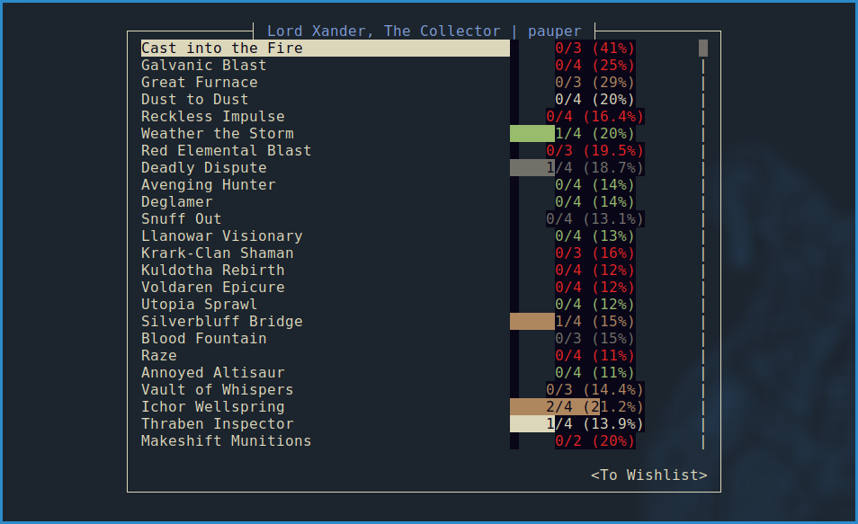

# Lord Xander, The Collector

Track your collection against the meta!

## Usage

Run it with `cargo run -r`

By default it looks at pauper but you can ask for `pioneer` and `legacy` as well
by doing `cargo run -r pioneer`.

Key bindings are:
- `Tab` to select different options
- `j`/`down` to scroll down
- `k`/`up` to scroll up
- `Enter` to select.
- `q` to quit
- `s` to show the selected card
- `/` to search for a card
- `g` to go to the top
- `G` to go to the bottom

The `To Wishlist` button at the bottom makes a wishlist of the cards you're
missing, sorted my playability.
